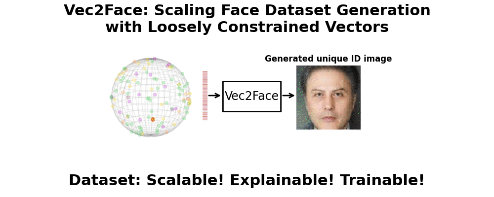
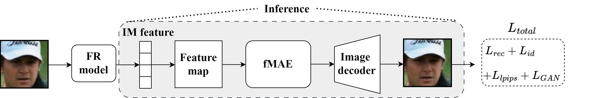

<div align="center">

# Vec2Face: Scaling Face Dataset Generation with Loosely Constrained Vectors

[Haiyu Wu](https://haiyuwu.netlify.app/)<sup>1</sup> &emsp; [Jaskirat Singh](https://1jsingh.github.io/)<sup>2</sup> &emsp; [Sicong Tian](https://github.com/sicongT)<sup>3</sup>   

[Liang Zheng](https://zheng-lab.cecs.anu.edu.au/)<sup>2</sup> &emsp; [Kevin W. Bowyer](https://www3.nd.edu/~kwb/)<sup>1</sup> &emsp;  

<sup>1</sup>University of Notre Dame<br>
<sup>2</sup>The Australian National University<br>
<sup>3</sup>Indiana University South Bend


<a href='https://haiyuwu.github.io/vec2face.github.io/'></a>
<a href='https://arxiv.org/abs/2409.02979'></a>
<a href='https://huggingface.co/BooBooWu/Vec2Face'></a>
<a href='https://huggingface.co/spaces/BooBooWu/Vec2Face'></a>
<a href='https://huggingface.co/datasets/BooBooWu/Vec2Face'></a>

</div>

This is the official implementation of **[Vec2Face](https://haiyuwu.github.io/vec2face.github.io/)**, an ID and attribute controllable face dataset generation model:

&emsp;✅ that generates face images purely based on the given image features<br>
&emsp;✅ that achieves state-of-the-art performance in five standard test sets among synthetic datasets<br>
&emsp;✅ that first achieves higher accuracy than the same-scale real dataset (on **CALFW, IJBB, and IJBC**)<br>
&emsp;✅ that can easily scale the dataset size to 10M images from 200k identities<br>
&emsp;**If you find Vec2Face useful for your research, please give a ⭐ and consider citing us 😄**<br>
```bibtex
@article{wu2025vec2face,
  title={Vec2Face: Scaling face dataset generation with loosely constrained vectors},
  author={Wu, Haiyu and Singh, Jaskirat and Tian, Sicong and Zheng, Liang and Bowyer, Kevin W},
  journal={ICLR},
  year={2025}
}
```



# News/Updates
- [2025/04/15] 🔧 **We fixed the mistake of uploading the older datasets, which has identity leakage.**
- [2025/01/22] 🔥 **It is accepted at ICLR2025!**
- [2024/09/15] 🔥 The generated [HSFace datasets](#download-datasets) are available now!
- [2024/09/05] 🔥 Our paper is on [Arxiv](https://arxiv.org/abs/2409.02979) now!
- [2024/09/02] 🔥 We release Vec2Face [demo](https://huggingface.co/spaces/BooBooWu/Vec2Face)!
- [2024/09/01] 🔥 We release Vec2Face and HSFace datasets!

# :wrench: Installation
```bash
conda env create -f environment.yaml
conda activate vec2face
```

# Download model weights
1) The weights of the Vec2Face model and estimators used in this work can be manually from [HuggingFace](https://huggingface.co/BooBooWu/Vec2Face) or using python:
```python
from huggingface_hub import hf_hub_download
hf_hub_download(repo_id="BooBooWu/Vec2Face", filename="weights/6DRepNet_300W_LP_AFLW2000.pth", local_dir="./")
hf_hub_download(repo_id="BooBooWu/Vec2Face", filename="weights/arcface-r100-glint360k.pth", local_dir="./")
hf_hub_download(repo_id="BooBooWu/Vec2Face", filename="weights/magface-r100-glint360k.pth", local_dir="./")
hf_hub_download(repo_id="BooBooWu/Vec2Face", filename="weights/vec2face_generator.pth", local_dir="./")
```
or
```commandline
python download_vec2face_weights.py
```
2) The weights of the FR models trained with HSFace (10k, 20k, 100k, 200k) can be downloaded using python:
```python
from huggingface_hub import hf_hub_download
hf_hub_download(repo_id="BooBooWu/Vec2Face", filename="fr_weights/hsface10k.pth", local_dir="./")
hf_hub_download(repo_id="BooBooWu/Vec2Face", filename="fr_weights/hsface20k.pth", local_dir="./")
hf_hub_download(repo_id="BooBooWu/Vec2Face", filename="fr_weights/hsface100k.pth", local_dir="./")
hf_hub_download(repo_id="BooBooWu/Vec2Face", filename="fr_weights/hsface200k.pth", local_dir="./")
hf_hub_download(repo_id="BooBooWu/Vec2Face", filename="fr_weights/hsface300k.pth", local_dir="./")
```

# Download datasets
The dataset used for **Vec2Face training** can be downloaded from manually from  [HuggingFace](https://huggingface.co/BooBooWu/Vec2Face) or using python:
```python
from huggingface_hub import hf_hub_download
hf_hub_download(repo_id="BooBooWu/Vec2Face", filename="lmdb_dataset/WebFace4M/WebFace4M.lmdb", local_dir="./")
hf_hub_download(repo_id="BooBooWu/Vec2Face", filename="lmdb_dataset/WebFace4M/50000_ids_1022444_ims.npy", local_dir="./")
```
The **generated synthetic datasets** HSFace300k can be downloaded at [Gdrive](https://drive.google.com/file/d/1djmxmrG8FfoGdJ-AlS46_S-lTqweQ3wp/view?usp=sharing) and [百度云](https://pan.baidu.com/s/1UplYNlDo_K33lfcVaQ2-xg) (code:vc2f), HSFace10k and HSFace20k can be downloaded using python:
```python
from huggingface_hub import hf_hub_download
hf_hub_download(repo_id="BooBooWu/Vec2Face", filename="HSFaces/hsface10k.lmdb", local_dir="./", repo_type="dataset")
hf_hub_download(repo_id="BooBooWu/Vec2Face", filename="HSFaces/hsface20k.lmdb", local_dir="./", repo_type="dataset")
``` 

For HSFace100k and HSFace200k, they are the first 100k and 200k folders in the HSFace300k. You can conveniently use the indices mask to train the model with either of them. The mask files can be downloaded using python:
```python
from huggingface_hub import hf_hub_download
hf_hub_download(repo_id="BooBooWu/Vec2Face", filename="HSFaces/hsface100k_mask.npy", local_dir="./", repo_type="dataset")
hf_hub_download(repo_id="BooBooWu/Vec2Face", filename="HSFaces/hsface200k_mask.npy", local_dir="./", repo_type="dataset")
```
and add another line in the config file for [FR model training](#fr-model-training):
```python
config.mask="./HSFaces/hsface100k_mask.npy"
```
Tip: If you want to convert .lmdb to datasets (images), please refer to [lmdb2dataset.py](https://github.com/HaiyuWu/SOTA-Face-Recognition-Train-and-Test/blob/main/utils/lmdb2dataset.py).
# Model Architecture


# ⚡Image generation
## Generating with reference images
Putting reference images in a folder or collecting image paths in a .txt file for preparation. Then run following code:
```commandline
python image_generation_with_reference.py \
--image_file "path/of/the/image/file or folder" \
--model_weights weights/vec2face_generator.pth \
--batch_size 5 \
--example 10 \
--name images-of-references
```
Note that, the input images should be cropped and aligned. If they are not, please use face detectors (e.g., [img2pose](https://github.com/vitoralbiero/img2pose)) to crop the images first.
We don't suggest you to modify the code to use the embedding extracted from insightface, because it takes forever to run. (Trust me, I have tried.)

## Generating with center/ID features
Before generating images, the identity vectors need to be created/calculated and saved in a .npy file. We provide an example for you, but you can create your own center features (see [issue #2](https://github.com/HaiyuWu/Vec2Face/issues/2)).  Another potential problem is the infinite loop, details can be found at [issue #18](https://github.com/HaiyuWu/Vec2Face/issues/18)
```python
from huggingface_hub import hf_hub_download
hf_hub_download(repo_id="BooBooWu/Vec2Face", filename="center_feature_examples.npy", local_dir="./")
```

Image generation with sampled identity features:
```commandline
python image_generation.py \
--model_weights weights/vec2face_generator.pth \
--batch_size 5 \
--example 1 \
--start_end 0:10 \
--name test \
--center_feature center_feature_examples.npy
```
Image generation with target yaw angle:
```commandline
python pose_image_generation.py \
--model_weights weights/vec2face_generator.pth \
--batch_size 5 \
--example 1 \
--start_end 0:10 \
--center_feature center_feature_examples.npy \
--name test \
--pose 45 \
--image_quality 25
```

# Training

## Vec2Face training
### Attention!: Different from the reporting training time in the original paper, we have optimized the coding for faster and more stable model training. Thus, the following configurations should be good enough to achieve a good result.
We only provide the WebFace4M dataset (see [here](#download-datasets)) and the mask that we used for training the model, if you want to use other datasets, please referring the 
[prepare_training_set.py](scripts/prepare_training_set.py) to convert the dataset to .lmdb. Please refer to [issue #3](https://github.com/HaiyuWu/Vec2Face/issues/3) for details.

Once the dataset is ready, modifying the following code to run the multi-node distributed training:
```commandline
torchrun --nproc_per_node=4 --node_rank=0 --master_addr="host_addr" --master_port=3333 vec2face.py \
--rep_drop_prob 0.1 \
--use_rep \
--batch_size 32 \
--model vec2face_vit_base_patch16 \
--epochs 100 \
--disc_start 80 \
--warmup_epochs 5 \
--blr 4e-5 \
--output_dir workspace/pixel_generator/ \
--train_source ./lmdb_dataset/WebFace4M/WebFace4M.lmdb \
--mask lmdb_dataset/WebFace4M/50000_ids_1022444_ims.npy \
--accum_iter 1
```
If training on one node, run with the following command:
```commandline
torchrun --nproc_per_node=4 vec2face.py \
--rep_drop_prob 0.1 \
--use_rep \
--batch_size 32 \
--model vec2face_vit_base_patch16 \
--epochs 100 \
--disc_start 80 \
--warmup_epochs 5 \
--blr 4e-5 \
--output_dir workspace/pixel_generator/ \
--train_source ./lmdb_dataset/WebFace4M/WebFace4M.lmdb \
--mask lmdb_dataset/WebFace4M/50000_ids_1022444_ims.npy \
--accum_iter 1
```

## FR model training
We borrowed the code from [SOTA-Face-Recognition-Train-and-Test](https://github.com/HaiyuWu/SOTA-Face-Recognition-Train-and-Test) to train the model. The random erasing function could be added after line 84 in [data_loader_train_lmdb.py](https://github.com/HaiyuWu/SOTA-Face-Recognition-Train-and-Test/blob/main/data/data_loader_train_lmdb.py), as shown below:
```python
transform = transforms.Compose(
            [
                transforms.Resize((112, 112)),
                transforms.RandomHorizontalFlip(),
                transforms.ToTensor(),
                transforms.Normalize([0.5, 0.5, 0.5], [0.5, 0.5, 0.5]),
                transforms.RandomErasing()
            ]
        )
```
Please follow the guidance of [SOTA-Face-Recognition-Train-and-Test](https://github.com/HaiyuWu/SOTA-Face-Recognition-Train-and-Test) for the rest of training process.

Since some people requested for the config file to reproduce the performance, here is the example of training with HSFace10K:
```python
from easydict import EasyDict

config = EasyDict()

config.prefix = "arcface-r50-vec2face-hsface10k"
config.head = "arcface"
config.input_size = [112, 112]
config.embedding_size = 512
config.depth = "50"
config.batch_size = 128
config.weight_decay = 5e-4
config.lr = 0.1
config.momentum = 0.9
config.epochs = 26
config.margin = 0.5
config.fp16 = True
config.sample_rate = 1.0
config.num_ims = 500000
config.reduce_lr = [12, 20, 24]
config.train_source = "./HSFaces/hsface10k.lmdb"
config.val_list = ["lfw", "cfp_fp", "agedb_30", "calfw", "cplfw"]
config.mask = None
config.augment = True
config.mode = "se"
```

## Performance

### Datasets in 0.5M scale

This table compares the existing synthetic dataset generation methods on five standard face recognition test sets. The model trained with HSFace10K has better performance on CALFW than that trained with real dataset.

| Training sets        | # images |    LFW    | CFP-FP |   CPLFW   |   AgeDB   |   CALFW   |   Avg.    |
| -------------------- | :------: | :-------: | :----: | :-------: | :-------: | :-------: | :-------: |
| IDiff-Face           |   0.5M   |   98.00   | 85.47  |   80.45   |   86.43   |   90.65   |   88.20   |
| DCFace               |   0.5M   |   98.55   | 85.33  |   82.62   |   89.70   |   91.60   |   89.56   |
| Arc2Face             |   0.5M   |   98.81   | 91.87  |   85.16   |   90.18   |   92.63   |   91.73   |
| DigiFace             |    1M    |   95.40   | 87.40  |   78.87   |   76.97   |   78.62   |   83.45   |
| SynFace              |   0.5M   |   91.93   | 75.03  |   70.43   |   61.63   |   74.73   |   74.75   |
| SFace                |   0.6M   |   91.87   | 73.86  |   73.20   |   71.68   |   77.93   |   77.71   |
| IDnet                |   0.5M   |   92.58   | 75.40  |   74.25   |   63.88   |   79.90   |   79.13   |
| ExFaceGAN            |   0.5M   |   93.50   | 73.84  |   71.60   |   78.92   |   82.98   |   80.17   |
| SFace2               |   0.6M   |   95.60   | 77.11  |   74.60   |   77.37   |   83.40   |   81.62   |
| Langevin-Disco       |   0.6M   |   96.60   | 73.89  |   74.77   |   80.70   |   87.77   |   82.75   |
| **HSFace10K(Ours)**  |   0.5M   | **98.87** | 88.97  | **85.47** | **93.12** | **93.57** | **92.00** |
| CASIA-WebFace (Real) |  0.49M   |   99.38   | 96.91  |   89.78   |   94.50   |   93.35   |   94.79   |

### Dataset scaling up to 300K identities and 15M images

This is the uniqueness of the proposed Vec2Face, which can easily scale the dataset size up.

| Datasets             | # images |  LFW  | CFP-FP | CPLFW | AgeDB |   CALFW   | Avg.  |
| -------------------- | :------: | :---: | :----: | :---: | :---: | :-------: | :---: |
| HSFace10K            |   0.5M   | 98.87 | 88.97  | 85.47 | 93.12 | **93.57** | 92.00 |
| HSFace20K            |    1M    | 98.87 | 89.87  | 86.13 | 93.85 | **93.65** | 92.47 |
| HSFace100K           |    5M    | 99.25 | 90.36  | 86.75 | 94.38 | **94.12** | 92.97 |
| HSFace200K           |   10M    | 99.23 | 90.81  | 87.30 | 94.22 | **94.52** | 93.22 |
| HSFace300K           |   15M    | 99.30 | 91.54  | 87.70 | 94.45 | **94.58** | 93.52 |
| CASIA-WebFace (Real) |  0.49M   | 99.38 | 96.91  | 89.78 | 94.50 |   93.35   | 94.79 |

### Other challenging test sets

We test the model performance on other four datasets, Hadrian (facial hair), Eclipse (face exposure), SLLFW (similar-looking), and DoppelVer (doppelganger). 

| Datasets             |  Hadrian  |  Eclipse  |   SLLFW   | DoppelVer |
| -------------------- | :-------: | :-------: | :-------: | :-------: |
| HSFace10K            |   69.47   |   64.55   |   92.87   |   86.91   |
| HSFace20K            |   75.22   |   67.55   |   94.37   |   88.91   |
| HSFace100K           | **80.00** | **70.35** |   95.58   |   90.39   |
| HSFace200K           | **79.85** | **71.12** |   95.70   |   89.86   |
| HSFace300K           | **81.55** | **71.35** |   95.95   |   90.49   |
| CASIA-WebFace (Real) |   77.82   |   68.52   | **96.95** | **95.11** |

# Acknowledgements
- Thanks to the WebFace4M creators for providing such a high-quality facial dataset❤️.
- Thanks to [Hugging Face](https://huggingface.co/) for providing a handy dataset and model weight management platform❤️.
- Thanks to [JiaquanYe](https://github.com/JiaquanYe) for helping the training stability❤️.
